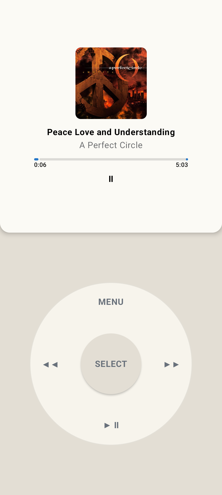

# Reclaimed Player

A purpose-built Android media appliance, initially targeting the Google Pixel 6 (`oriole`).



## Development setup

[`mise`](https://mise.jdx.dev/getting-started.html) is the only development tool that must be
installed outside the repository. On macOS, install it with `brew install mise`. The checked-in
`mise.toml` then provides Java 17, Android command-line tools, and `just`; Gradle itself is provided
by the checked-in wrapper.

For a new checkout, run:

```sh
mise trust
mise install
mise exec -- just setup
mise exec -- just doctor
```

`just setup` presents the Android license prompts and installs platform-tools, the Android 36 SDK,
and build-tools 36.0.0. Run it again if the required SDK packages change. After pulling changes to
`mise.toml`, run `mise install` again to install any newly declared tool versions.

### Daily commands

If mise is [activated in your shell](https://mise.jdx.dev/getting-started.html#activate-mise), run
recipes directly:

```sh
just check
just devices
just install
```

Shell activation is optional. Without it, run the same recipes through mise so the repository's
tool versions and environment are active for that command:

```sh
mise exec -- just check
mise exec -- just devices
mise exec -- just install
```

Run `just` or `mise exec -- just` to list all recipes.

| Recipe | Purpose |
| --- | --- |
| `setup` | Accept Android licenses and install required SDK packages. |
| `doctor` | Verify Java, Android SDK, build-tools, and ADB availability. |
| `build` | Compile the debug APK. |
| `lint` | Run Android lint for the debug build. |
| `test` | Run debug unit tests. |
| `check` | Run build, lint, and unit tests together. |
| `devices` | List connected Android devices. |
| `install` | Install a debug APK while preserving app data. |
| `tasks` | List every available Gradle task. |
| `clean` | Remove generated build output. |

Every recipe loads `scripts/android-env.sh`. It preserves mise's environment while retaining the
old Homebrew paths as a fallback for direct Gradle or ADB use.

The initial proof of concept is both a normal launchable activity and an Android Home candidate. This lets us test the shell without removing the existing launcher.

## Device workflow

```sh
mise exec -- just install
mise exec -- sh -c \
  '. scripts/android-env.sh && adb shell cmd package set-home-activity --user 0 dev.reclaimed.player/.MainActivity'
```

Restore the standard GrapheneOS launcher with:

```sh
mise exec -- sh -c \
  '. scripts/android-env.sh && adb shell cmd package set-home-activity --user 0 com.android.launcher3/.uioverrides.QuickstepLauncher'
```

## Current proof of concept

- Reads local audio through Android MediaStore.
- Groups the library by artist and album.
- Loads embedded album artwork through MediaStore album-art URIs.
- Creates ordered album queues in a Media3 `MediaSessionService`.
- Persists and restores complete queues, playback position, shuffle/repeat state, and paused or
  playing intent across service and process recreation.
- Supports background playback and system/Bluetooth media controls.
- Serves as the device's default Home activity.
- Separates local and remote catalogs behind a source-first home screen.
- Offers persisted Classic and Touch interfaces over the same navigation and playback state.
- Provides a full-screen virtual Click Wheel with haptic menu navigation, transport controls,
  volume control on Now Playing, and a long-press Menu shortcut back to Touch mode.
- Authenticates to Jellyfin with Quick Connect and browses a selected music library.
- Opens Jellyfin from an app-private compressed metadata snapshot, refreshes stale snapshots
  in the background, and schedules a network-constrained sync every six hours.
- Streams Jellyfin albums with authenticated Media3 requests.
- Downloads Jellyfin albums into app-managed storage and prefers offline copies during playback.
- Downloads authenticated Jellyfin album artwork with each album and prefers the local cover offline.
- Provides a shared Downloads manager with offline album browsing, status, disk usage,
  playback, and removal controls in both Classic and Touch modes.
