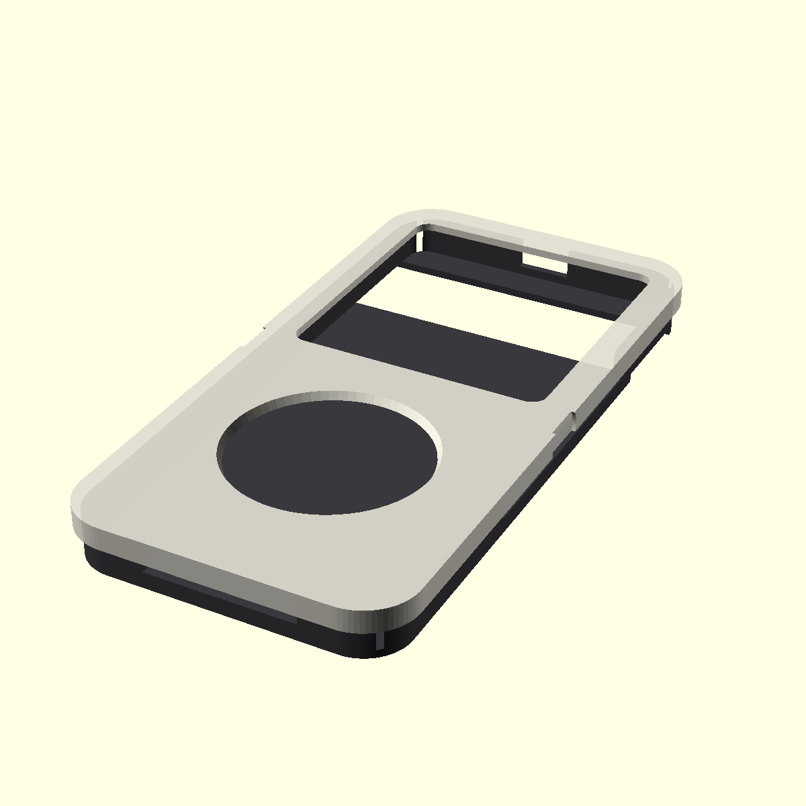

# Pixel 6 removable iPod-style case

This is a two-part, parametric case for the Google Pixel 6 running Reclaimed Player's Classic UI:



- **Cradle:** a protective back and bumper with broad camera-bar, USB-C/speaker, microphone, and
  right-side button reliefs.
- **Faceplate:** a removable snap cap that masks the rest of the touchscreen while leaving the
  upper Classic display and virtual Click Wheel directly touchable.

The source model is [`pixel6_ipod_case.scad`](pixel6_ipod_case.scad). Ready-to-slice exports are
[`pixel6-ipod-cradle.stl`](stl/pixel6-ipod-cradle.stl) and
[`pixel6-ipod-faceplate.stl`](stl/pixel6-ipod-faceplate.stl). It is intentionally easy to adjust
after a small fit test; consumer FDM printers and phone dimensions vary enough that a first print
should be treated as a prototype.

## Export and print

Rendering is headless and containerized. It never invokes the macOS OpenSCAD application, so it is
safe for agents, local scripts, and CI:

```sh
cd hardware/pixel6-ipod-case
./render.sh
```

The first run downloads the pinned official `openscad/openscad:2021.01` Docker image. It regenerates
both STLs and `assembly-preview.png`. Useful variants:

```sh
./render.sh --check        # fail if checked-in renders are stale
./render.sh --only stl     # regenerate only the printable solids
./render.sh --only preview # regenerate only the README image
./render.sh --pull         # explicitly refresh the pinned image
```

Docker is the only local prerequisite. GitHub Actions also runs `--check` whenever hardware files
change. Do not call `/Applications/OpenSCAD.app/Contents/MacOS/OpenSCAD` from automation; on this
machine its Qt runtime crashes in non-GUI execution and opens a macOS crash dialog.

Both generated parts already have their broad exterior faces on the bed: the cradle's back lies
flat, and the faceplate's skirt and snap nubs point upward.

Suggested first print:

- PETG, ASA, or another slightly flexible material. PLA can work, but the snap skirt is more likely
  to fatigue or crack.
- 0.20 mm layers, 4 perimeters, 5 top/bottom layers, 15-25% infill.
- No support should be required with ordinary 0.4 mm extrusion width.
- Add a thin screen protector before using the fascia. Deburr and lightly sand every edge that can
  touch the phone.

## Fit tuning

The important parameters are near the top of the SCAD file:

- `phone_clearance = 0.45`: increase by 0.15-0.25 mm if the phone will not seat; decrease if the
  cradle rattles.
- `cap_clearance = 0.30`: increase if the faceplate is too hard to remove; decrease if it is loose.
- `phone_cavity_corner_radius = 4.5`: this deliberately keeps the inside corners squarer than the
  exterior after the first physical fit showed the original 9.45 mm cavity radius blocked seating.
- `wheel_opening_diameter = 48.0`: enlarge if the aperture interferes with circular gestures.
- `wheel_gap_below_screen = 15.0`: controls the solid bridge between the display and wheel openings.
- `screen_window_*` and `wheel_center_*`: tune these if the app layout changes.

The default dimensions assume a bare Pixel 6, not a phone already inside another case. Google lists
the nominal phone envelope as 158.6 x 74.8 x 8.9 mm. Measure the actual device with calipers before a
long final print, especially its depth around the camera bar.

## Safe first fitting

1. Verify the camera bar enters the full-width rear opening without contact.
2. Slide the phone into the cradle without forcing it; stop if the glass or buttons bind.
3. Test the faceplate without the phone, then with a screen protector installed.
4. Press the cap on from one long edge and peel it off using a side thumb scallop.
5. Confirm Menu, Previous, Select, Next, and Play/Pause all register around the entire wheel.

Do not leave a dark, heat-absorbing print in direct sun with the phone installed. Revision 2 includes
measurements from one physical-device fit, but the revised clearances, touch behavior, drop safety,
and thermal behavior still need validation.
